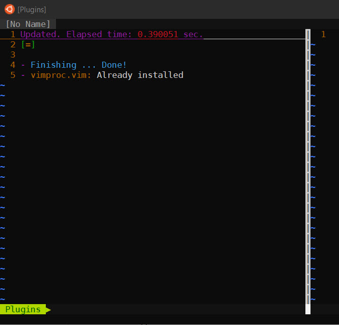
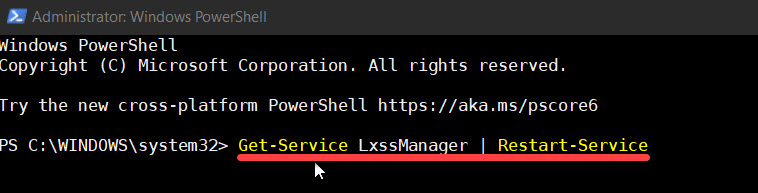
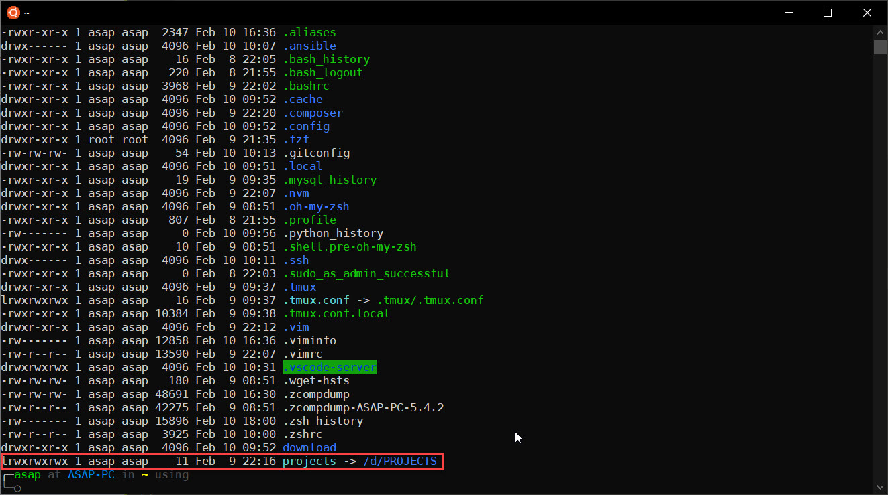

# Windows 10 Pro - WSL Ubuntu for Web Server (Base Ubuntu 20.04 LTS)

Depending on the operating system you are using:

- Ubuntu 18.04 LTS and you can use the `wsl-ubuntu-18.04` branch
- Ubuntu 20.04 LTS and you can use the `master` branch

> Note for `Ubuntu 20.04`, pre installation:

```bash
sudo apt-get clean
sudo rm -rf /var/lib/apt/lists
sudo mkdir -p /var/lib/apt/lists/partial
sudo apt-get clean
sudo apt-get update
sudo apt-get -u dist-upgrade
```

---

## Customize your terminal (Oh My Zsh) on Ubuntu

Install ZSH and support for Powerline fonts

```bash
sudo apt install zsh -y
sudo apt install powerline fonts-powerline -y
```

Install Oh-my-zsh se instruction on [oh-my-zsh web](https://ohmyz.sh/#install)

via `curl`

```bash
sh -c "$(curl -fsSL https://raw.github.com/ohmyzsh/ohmyzsh/master/tools/install.sh)"
```

or via `wget`

```bash
sh -c "$(wget https://raw.github.com/ohmyzsh/ohmyzsh/master/tools/install.sh -O -)"
```

Follow the instruction and change terminal theme do you want.

Install Plugin for your ZSH

1. zsh-syntax-highlighting [repo](https://github.com/zsh-users/zsh-syntax-highlighting) and [installation](https://github.com/zsh-users/zsh-syntax-highlighting/blob/master/INSTALL.md)
1. zsh-autosuggestions [repo](https://github.com/zsh-users/zsh-autosuggestions) and [installtion](https://github.com/zsh-users/zsh-autosuggestions/blob/master/INSTALL.md)
1. zsh-completions [repo and installation](https://github.com/zsh-users/zsh-completions)

Now in your `.zshrc` look:

```bash
plugins=(git zsh-syntax-highlighting zsh-autosuggestions zsh-completions)
autoload -U compinit && compinit
```

## Customize your Aliases on Ubuntu

> Copy from repo on `.config` directory and paste to your root or home user.

Rename file `.env.sample` to `.env` in your `.config` directory and change content in block:

```bash
# Your environment variables, you should change depend of your system setup
TLD_DOMAIN='test'
NGINX_VHOST_LOCATION=$HOME'/.config/vhosts'
PROJECT_LOCATION=$HOME'/projects/www'
```

You can change with your own project.

Then

Setup sources aliases and functions to your `.zshrc`

```bash
source $HOME/.config/.aliases
source $HOME/.config/.functions
```

## Customize your VIM on Ubuntu

> Copy file `.vimrc` to your root or home user directory

Open terminal

```bash
vim
```

From your terminal console will see installation all plugin from yout `.vimrc` or you can add plugin manualy.



---

## **LEMP Stack** + **Node Js**

## Before run all file bash script

You can mount windows drive to WSL which create wsl config on etc

`sudo vim /etc/wsl.conf`

Add this config:

```bash
# Enable extra metadata options by default
[automount]
enabled = true
root = /
options = "metadata,umask=22,fmask=11"
mountFsTab = false

# Enable DNS – even though these are turned on by default, we’ll specify here just to be explicit.
[network]
generateHosts = true
generateResolvConf = true
```

Save it `:wq` and restart WSL (open PowerShell as Administrator) then execute below this

```bash
Get-Service LxssManager | Restart-Service
```



You can check that drive show on wsl:

`ls -al /c/` or `ls -al /d/`

Than you can link (Win10) project directory to (WSL) home directory etc:

`ln -s /d/projects ~/.`



Next step:

```bash
sudo apt update && sudo apt upgrade -y
```

> Copy or clone this repository to your home directory
> Change directory to project `wsl-web-config`

### 1. Install Nginx

> ./install-nginx-on-wsl.sh

Copy all snippet files configuration: `sudo cp -r etc/nginx/snippets/* /etc/nginx/snippets`
And you can change Nginx config `nginx.conf` for optimize, sample config: `etc/nginx/nginx.conf`
Adding custom Virtual Hosts to your Nginx config, sample `$HOME/.config/vhosts`

// you can change "username" with your username

> include /home/`username`/.config/vhosts/\*;

Sample virtual host for `Laravel` project, file name: `laravel-project`

> set \$base /home/`username`/projects/laravel-project; change by your username

```bash
server {
    listen 80;
    listen [::]:80;

    server_name laravel-project.test;
    set $base /home/username/projects/laravel-project;
    root $base/public;

    index index.php index.html index.htm;

    location / {
        try_files $uri $uri/ /index.php?$query_string;
    }

    error_page 404 /index.php;

    location ~ \.php$ {
        include snippets/php_fastcgi.conf;
    }

    # additional config
    include snippets/general.conf;

    location ~ /\.(?!well-known).* {
        deny all;
    }
}
```

After install and custom configurations setup now with aliases you can run services:

- `s:nginx start`
- `s:nginx restart`
- `s:nginx stop`
- `s:nginx status`

### 2. Install MySQL

> ./install-mysql8-on-wsl.sh

Handdling MySQL Error Socket `/var/run/mysqld/mysqld.sock`

```bash
sudo service mysql stop
sudo usermod -d /var/lib/mysql/ mysql
sudo service mysql start
Exit
```

Now you have MySQL Server on your system (use aliases).

- `s:mdb start`
- `s:mdb restart`
- `s:mdb stop`
- `s:mdb status`

Start Service and try use mysql cli

```bash
sudo mysql -u root -p
```

Setup secure MySQL with password

```bash
sudo mysql_secure_installation
```

You can see password validate configuration metrics using the following query in MySQL client:

```bash
sudo mysql -u root -p
```

```bash
mysql> SHOW VARIABLES LIKE 'validate_password%';
```

The output should be something like that :

| Variable_name                        | Value  |
| ------------------------------------ | ------ |
| validate_password.check_user_name    | ON     |
| validate_password.dictionary_file    |
| validate_password.length             | 8      |
| validate_password.mixed_case_count   | 1      |
| validate_password.number_count       | 1      |
| validate_password.policy             | MEDIUM |
| validate_password.special_char_count | 1      |

Then you can set the password policy level lower, for example:

```bash
mysql> SET GLOBAL validate_password.length = 6;
mysql> SET GLOBAL validate_password.number_count = 0;
mysql> SET GLOBAL validate_password.policy = 0;
```

```bash
mysql> SHOW VARIABLES LIKE 'validate_password%';
```

The output should be something like that :

| Variable_name                        | Value |
| ------------------------------------ | ----- |
| validate_password.check_user_name    | ON    |
| validate_password.dictionary_file    |
| validate_password.length             | 6     |
| validate_password.mixed_case_count   | 1     |
| validate_password.number_count       | 1     |
| validate_password.policy             | LOW   |
| validate_password.special_char_count | 1     |

You can install with above script and with aliases you can run services:

- `s:mdb start`
- `s:mdb restart`
- `s:mdb stop`
- `s:mdb status`

### 3. Install PHP7.4 FPM

NOTE: Ubuntu 20.04 ships with PHP 7.4 in its upstream repositories. Just install it and the extensions you with the apt package manager.

> ./install-php-fpm-on-wsl.sh

You can install with above script and with aliases you can run services:

- `s:php start`
- `s:php restart`
- `s:php stop`
- `s:php status`

> Fastcgi Settings on `/etc/nginx/snippets/php_fastcgi.conf`
> TCP `fastcgi_pass 127.0.0.1:9000;`
> Socket `fastcgi_pass unix:/var/run/php/php7.4-fpm.sock;`

Before you can user fastcgi_pass `TCP` you should change php7.4-fpm config on www.conf: `/etc/php/7.4/fpm/pool.d/www.conf`

```bash
; The address on which to accept FastCGI requests.
; Valid syntaxes are:
;   'ip.add.re.ss:port'    - to listen on a TCP socket to a specific IPv4 address on
;                            a specific port;
;   '[ip:6:addr:ess]:port' - to listen on a TCP socket to a specific IPv6 address on
;                            a specific port;
;   'port'                 - to listen on a TCP socket to all addresses
;                            (IPv6 and IPv4-mapped) on a specific port;
;   '/path/to/unix/socket' - to listen on a unix socket.
; Note: This value is mandatory.
listen = /run/php/php7.4-fpm.sock
```

Change to:

```bash
; The address on which to accept FastCGI requests.
; Valid syntaxes are:
;   'ip.add.re.ss:port'    - to listen on a TCP socket to a specific IPv4 address on
;                            a specific port;
;   '[ip:6:addr:ess]:port' - to listen on a TCP socket to a specific IPv6 address on
;                            a specific port;
;   'port'                 - to listen on a TCP socket to all addresses
;                            (IPv6 and IPv4-mapped) on a specific port;
;   '/path/to/unix/socket' - to listen on a unix socket.
; Note: This value is mandatory.
; listen = /run/php/php7.4-fpm.sock
listen = 127.0.0.1:9000
```

### 4. Install Redis Server

> ./install-redis-on-wsl.sh

Now you have Redis Server on your system (use aliases).

- `s:rdb start`
- `s:rdb restart`
- `s:rdb stop`
- `s:rdb status`

### 5. Install NODE JS use NVM

> ./install-nvm-on-wsl.sh

Now you have Node JS on your system.

Reference [NVM Repo](https://github.com/nvm-sh/nvm#installing-and-updating)

### 6. Install MongoDB from Package Repo Ubuntu

> ./install-mongodb-on-wsl.sh

Now you have MongoDB Server on your system (use aliases).

- `s:mgdb start`
- `s:mgdb restart`
- `s:mgdb stop`
- `s:mgdb status`

Connection to mongodb shell

```bash
mongo --host 127.0.0.1:27017
```

**Adding Admin User**

By default, authentication is not enabled for MongoDB users. In production environment, it may be required to secure your server and enable user authentication.

Use the steps below to do that.

If you want to enable authentication, run the commands to create a new admin user after you’ve logged into MongoDB server.

```bash
mongo --host 127.0.0.1:27017
```

```bash
> use admin
```

Then run the commands below to create a new admin user

```bash
> db.createUser({user:"admin", pwd:"new_password_here", roles:[{role:"root", db:"admin"}]})
```

You should see a successful admin user created:

```bash
Successfully added user: {
	"user" : "admin",
	"roles" : [
		{
			"role" : "root",
			"db" : "admin"
		}
	]
}
```

Exit and continue below to enable MongoDB logon authentication.

Run the commands below to open MongoDB config file.

```bash
sudo vim /lib/systemd/system/mongod.service
```

Then change the highlighted line to look like the one below and save.

```bash
[Service]
User=mongodb
Group=mongodb
ExecStart=/usr/bin/mongod --auth --config /etc/mongod.conf
PIDFile=/var/run/mongodb/mongod.pid
```

Save and exit.

Restart MongDB to make the changes apply.

```bash
s:mgdb start
```

After installing MongoDB, its default configuration file is located at `/etc/mongod.conf`.

It is recommended to enable authentication since all users can access the database without authenticating.

To do that, open the configuration file by running the commands below:

```bash
sudo nano /etc/mongod.conf
```

Then edit the line shown below to enabled:

```bash
security:
  authorization: enabled
```

Restart MongoDB services after making the changes above.

```bash
s:mgdb restart
```

Now only authentication users will be allowed to access the database server.

```bash
mongo -u admin -p new_password_here --authenticationDatabase admin
```

Run the commands below to verify that authentication is enabled.

```bash
mongo -u admin -p --authenticationDatabase admin
```

You should then be prompted for a password.

### 7. Install Postgresql

> ./install-postgrsql-on-wsl.sh

Now you have Postgres Server on your system (use aliases).

- `s:pdb start`
- `s:pdb restart`
- `s:pdb stop`
- `s:pdb status`

**Set PostgreSQL admin user’s password and do testing**

Set a password for the default admin user

```bash
sudo su - postgres
postgres@asap:~$ psql -c "alter user postgres with password 'StrongPassword'"
```

Testing create user

```bash
createuser asapdotid
```

Add test database:

```bash
createdb testdb -O asapdotid
```

Setup password for user Asapdotid

```bash
psql
postgres=# alter user asapdotid with password 'asapdotid123';
```

Connect to use database `testdb`

```bash
\c testdb
```

Create table and add some dummy data:

```bash
create table test_table ( id int,first_name text, last_name text );
insert into test_table (id,first_name,last_name) values (1,'Foo','Bar');
select * from test_table;
```

After successfully create table, you should drop table and quite from `testdb`

```bash
DROP TABLE test_table;
/q
```

So you can drop databse `testdb`:

```bash
postgres@asap:~$ dropdb testdb;
```

---

## Add correct permission files and directory optional (Laravel storage & boostrap/cache directory)

You can run shell script `setPermission.sh` and follow instruction

first setup `setPermission.sh` to executable:

> chmod +x setPermission.sh

Then execute the file in terminal: `./setPermission.sh`

or

You can add in composer.json on root Laravel project

```bash
"scripts": {
    "post-install-cmd": [
      "chgrp -R www-data storage bootstrap/cache",
      "chmod -R ug+rwx storage bootstrap/cache"
    ]
}
```

---

Do not hesitate if there are suggestions and criticisms 😃 [@asapdotid](https://github.com/asapdotid)
